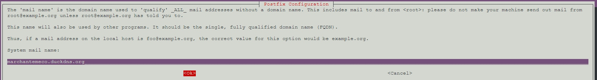
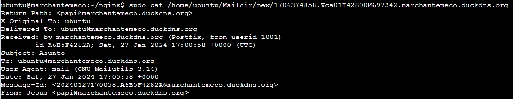
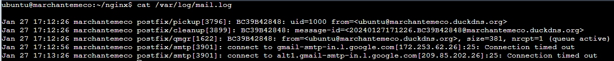
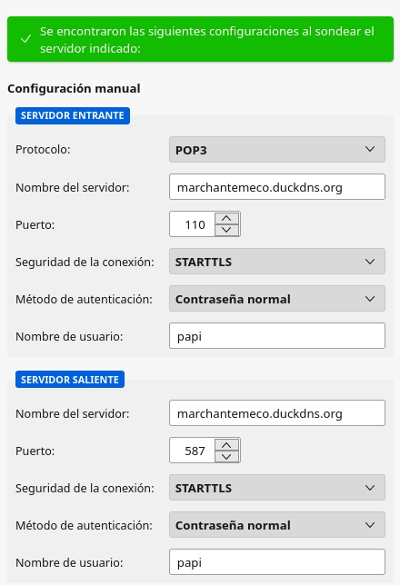
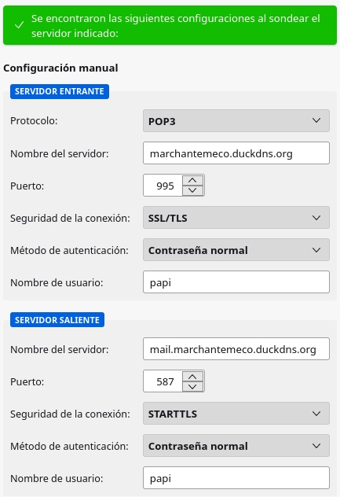
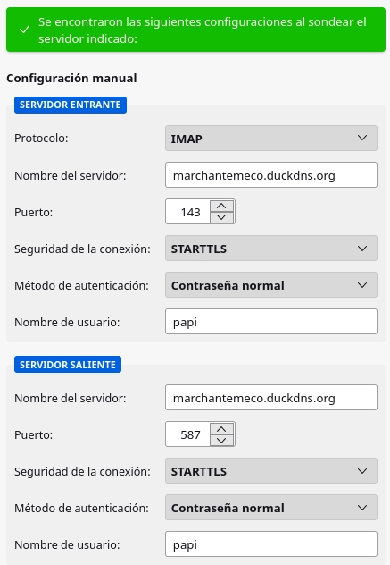
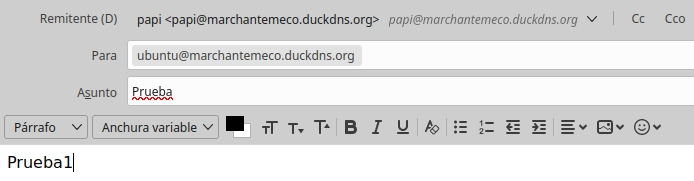
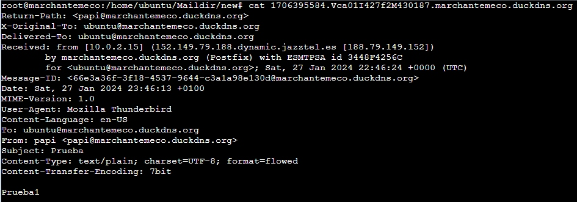
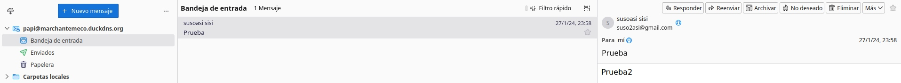

# Servidor de correo Postfix + Dovecot
***
En la instancia de AWS donde implementamos docker con Nginx, vamos a instalar un servicio de correo electrónico.  
Para ello configuraremos:  
- MTA: Postfix **instalado**, con los protocolos SMTP y STARTTLS  
- MDA: Dovecot **instalado**, con los protocolos IMAP, IMAPs y opcionalmente POP3 y POP3s  
- MUA: Thunderbird para realizar las prueba gráficamente    
Como ampliación podéis configurar una aplicación WEB para el correo electrónico  https://squirrelmail.org/  

Debemos tener abiertos en la instancia los puertos TCP 25 (SMTP), 587 (SMTPS), 110 (POP3), 995 (POP3S), 143 (IMAP) y 993 (IMAPS)  
1. Instalación, configuración y pruebas de Postfix  
    - Instalación:  
    Antes de instalar Postfix debemos establecer un nombre de dominio completamente cualificado (FQDN) para el servidor de correo marchantemeco.duckdns.org:  
    ```sudo hostnamectl set-hostname marchantemeco.duckdns.org```  
    Añanimos "127.0.0.1 marchantemeco.duckdns.org localhost" al archivo /etc/hosts:  
    ```echo "127.0.0.1 marchantemeco.duckdns.org localhost" | sudo tee -a /etc/hosts```  
    Ahora sí pasamos a instar Postfix:  
    ```sudo apt install postfix```  
    Por no hacerlo muy largo, sólo comentaré que durante todos los pasos de la instación deberemos introducir nuestro FQDN:  
     
    Si nos hemos equivocado en algo podemos volver a empezar:  
  ```sudo dpkg-reconfigure postfix```  
    - Configuración:  
    **/etc/postfix/main.cf**  
    Para que cada usuario tenga su buzón en su home/Maildir en vez de estar todo en /var/mail/usuario editamos /etc/postfix/main.cf y añadimos al final "home_mailbox = Maildir/"  
    ```sudo postconf -e 'home_mailbox= Maildir\'```  
    Dado que ya tenemos un certificado para nuestro sitio web marchantemeco.duckdns.org en nuestro contenedor Nginx compartido mediante un volumen (certs:/etc/nginx/certs:ro), podemos aprovecharlo para nuestro servidor de correo.  
    ¿pero dónde está ese volumen en nuestro equipo local?  
    Para averiguarlo:  
    ```docker volume ls```  
    ```docker volume inspect nombre_volumen```  
    Ahora ya sabemos que podemos aprovechar nuestros certificados en **/var/lib/docker/volumes/nginx_certs/_data/marchantemeco.duckdns.org**  
    Si no tuviésemos dichos certificados podemos crear unos firmados por letsencrypt:  
    ```sudo apt install certbot -y```  
    ```sudo certbot certonly --standalone --rsa-key-size 4096 --agree-tos --preferred-challenges http -d marchantemeco.duckdns.org```  
    Editamos el archivo indicando la ruta del certificado y clave pública, y de paso estableceremos algunas reglas para evitar el spam; quedará así:  
      ```
      myhostname = marchantemeco.duckdns.org
      myorigin = /etc/mailname
      mydomain = marchantemeco.duckdns.org
      mydestination = $myhostname, marchantemeco.duckdns.org, localhost.duckdns.org, , localhost

      smtpd_banner = $myhostname ESMTP $mail_name (Ubuntu)
      biff = no
      append_dot_mydomain = no
      readme_directory = no
      compatibility_level = 3.6

      smtpd_tls_cert_file=/var/lib/docker/volumes/nginx_certs/_data/marchantemeco.duckdns.org/cert.pem
      smtpd_tls_key_file=/var/lib/docker/volumes/nginx_certs/_data/marchantemeco.duckdns.org/key.pem
      smtp_tls_CApath=/var/lib/docker/volumes/nginx_certs/_data/marchantemeco.duckdns.org
      smtpd_use_tls=yes
      smtpd_tls_auth_only=yes
      smtpd_tls_security_level=may
      smtp_tls_security_level=may
      smtp_tls_session_cache_database = btree:${data_directory}/smtp_scache

      alias_maps = hash:/etc/aliases
      alias_database = hash:/etc/aliases
      relayhost =
      mynetworks = 127.0.0.0/8 [::ffff:127.0.0.0]/104 [::1]/128
      mailbox_size_limit = 0
      recipient_delimiter = +
      inet_interfaces = all
      inet_protocols = ipv4

      # Anti-SPAM rules adapted from https://wiki.debian.org/Postfix
      # Updated with https://docs.spamhaus.com/datasets/docs/source/40-real-world-usage/PublicMirrors/MTAs/020-Postfix.html
      smtpd_recipient_restrictions = permit_sasl_authenticated,
        reject_invalid_hostname,
        reject_unknown_recipient_domain,
        reject_unauth_destination,
        #reject_rbl_client zen.spamhaus.org=127.0.0.[2..11]
        reject_rhsbl_sender dbl.spamhaus.org=127.0.1.[2..99]
        reject_rhsbl_helo dbl.spamhaus.org=127.0.1.[2..99]
        reject_rhsbl_reverse_client dbl.spamhaus.org=127.0.1.[2..99]
        warn_if_reject reject_rbl_client zen.spamhaus.org=127.255.255.[1..255]
        permit
      smtpd_helo_restrictions = permit_sasl_authenticated,
        reject_invalid_helo_hostname,
        reject_non_fqdn_helo_hostname,
        reject_unknown_helo_hostname
      smtpd_client_restrictions = permit_mynetworks,
        permit_sasl_authenticated,
        reject_unauth_destination,
        #reject_rbl_client cbl.abuseat.org,
        permit

      # Mail user agent restrictions adapted from https://askubuntu.com/a/1132874
      smtpd_restriction_classes = mua_sender_restrictions,
        mua_client_restrictions,
        mua_helo_restrictions
      mua_sender_restrictions = permit_sasl_authenticated, reject
      mua_client_restrictions = permit_sasl_authenticated, reject
      mua_helo_restrictions = permit_mynetworks,
        reject_non_fqdn_hostname,
        reject_invalid_hostname,
        permit

      home_mailbox = Maildir/
      mailbox_command =

      # From http://wiki2.dovecot.org/HowTo/PostfixAndDovecotSASL
      smtpd_sasl_type = dovecot
      smtpd_sasl_path = private/auth
      smtpd_sasl_auth_enable = yes
      ```  
      **/etc/postfix/master.cf**  
    Habilitamos submission y añadimos al final "dovecot   unix  -       n       n       -       -       pipe
    flags=DRhu user=email:email argv=/usr/lib/dovecot/deliver -f ${sender} -d ${recipient}"  
    Quedará así:  
      ```
      smtp      inet  n       -       y       -       -       smtpd

      submission inet n       -       y       -       -       smtpd
        -o syslog_name=postfix/submission
        -o smtpd_tls_security_level=encrypt
        -o smtpd_sasl_auth_enable=yes
        -o smtpd_reject_unlisted_recipient=no
        -o smtpd_client_restrictions=$mua_client_restrictions
        -o smtpd_helo_restrictions=$mua_helo_restrictions
        -o smtpd_sender_restrictions=$mua_sender_restrictions
        -o smtpd_recipient_restrictions=
        -o smtpd_relay_restrictions=permit_sasl_authenticated,reject
        -o milter_macro_daemon_name=ORIGINATING

        pickup    unix  n       -       y       60      1       pickup
        cleanup   unix  n       -       y       -       0       cleanup
        qmgr      unix  n       -       n       300     1       qmgr
        #qmgr     unix  n       -       n       300     1       oqmgr
        tlsmgr    unix  -       -       y       1000?   1       tlsmgr
        rewrite   unix  -       -       y       -       -       trivial-rewrite
        bounce    unix  -       -       y       -       0       bounce
        defer     unix  -       -       y       -       0       bounce
        trace     unix  -       -       y       -       0       bounce
        verify    unix  -       -       y       -       1       verify
        flush     unix  n       -       y       1000?   0       flush
        proxymap  unix  -       -       n       -       -       proxymap
        proxywrite unix -       -       n       -       1       proxymap
        smtp      unix  -       -       y       -       -       smtp
        relay     unix  -       -       y       -       -       smtp
                -o syslog_name=postfix/$service_name
        #       -o smtp_helo_timeout=5 -o smtp_connect_timeout=5
        showq     unix  n       -       y       -       -       showq
        error     unix  -       -       y       -       -       error
        retry     unix  -       -       y       -       -       error
        discard   unix  -       -       y       -       -       discard
        local     unix  -       n       n       -       -       local
        virtual   unix  -       n       n       -       -       virtual
        lmtp      unix  -       -       y       -       -       lmtp
        anvil     unix  -       -       y       -       1       anvil
        scache    unix  -       -       y       -       1       scache
        postlog   unix-dgram n  -       n       -       1       postlogd

        maildrop  unix  -       n       n       -       -       pipe
          flags=DRXhu user=vmail argv=/usr/bin/maildrop -d ${recipient}

        uucp      unix  -       n       n       -       -       pipe
          flags=Fqhu user=uucp argv=uux -r -n -z -a$sender - $nexthop!rmail ($recipient)

        ifmail    unix  -       n       n       -       -       pipe
          flags=F user=ftn argv=/usr/lib/ifmail/ifmail -r $nexthop ($recipient)
        bsmtp     unix  -       n       n       -       -       pipe
          flags=Fq. user=bsmtp argv=/usr/lib/bsmtp/bsmtp -t$nexthop -f$sender $recipient
        scalemail-backend unix -       n       n       -       2       pipe
          flags=R user=scalemail argv=/usr/lib/scalemail/bin/scalemail-store ${nexthop} ${user} ${extension}
        mailman   unix  -       n       n       -       -       pipe
          flags=FRX user=list argv=/usr/lib/mailman/bin/postfix-to-mailman.py ${nexthop} ${user}

        dovecot   unix  -       n       n       -       -       pipe
          flags=DRhu user=email:email argv=/usr/lib/dovecot/deliver -f ${sender} -d ${recipient}
        ```  
        ```sudo postfix check``` para ver si hay errores de configuración.  
        ```sudo systemctl restart postfix``` para aplicar los cambios.  
    - Pruebas:  
      Ya disponemos del usuario local "ubuntu", pero mediante ```adduser papi``` crearemos al usuario "papi" y desde él enviaremos los siguiente correos:     
      - Envío local  
        ```echo "Cuerpo del correo" | mail -s "Asunto" ubuntu```  
        Si hacemos un ```sudo cat /home/ubuntu/Maildir/new/1706374858.Vca01I42800M697242.marchantemeco.duckdns.org```  podemos comprobar que el usuario local "ubuntu" recibió el correo  
         
      - Envío externo  
      ```echo "Cuerpo del correo" | mail -s "Asunto" suso2asi@gmail.com```  
        Si hacemos un ```cat /var/log/mail.log``` veremos que no es capaz de conectar por el puerto 25, informándonos de un "Connection timed out".  
        Esto es porque AWS, o quizás nuestro ISP si probáramos en nuestro hogar, **capa el puerto 25** para evitar el spam, pero este puerto lo utilizan los servidores de correo para negociar la conexión, por lo tanto **cualquier correo que enviáramos fuera de marchantemeco.duckdns.org no llegará a su destino**.  
         
2. Instalación, configuración y pruebas de Dovecot  
    - Instalación:  
    ```sudo apt install dovecot-imapd dovecot-pop3d```
    - Configuración:  
    **/etc/dovecot/dovecot.conf**  
    Descomentamos la línea #listen = *, :: para que escuche por todas las interfaces de red; quedará así:  
      ```
      !include_try /usr/share/dovecot/protocols.d/*.protocol
      listen = *, ::
      dict {
        #quota = mysql:/etc/dovecot/dovecot-dict-sql.conf.ext
      }
      !include conf.d/*.conf
      !include_try local.conf
      ```  
      **/etc/dovecot/conf.d/10-mail.conf**  
      Como en Postfix configuramos los buzones en formato **Maildir**, aquí lo configuraremos igua; editamos la línea mail_location en mail_location = maildir:~/Maildir; quedará así:  
      ```
      mail_location = maildir:~/Maildir
      namespace inbox {
        inbox = yes
      }
      mail_privileged_group = mail
      protocol !indexer-worker {
      }
      ```  
      **/etc/dovecot/conf.d/10-auth.conf**  
      Forzamos SSL/TLS editanto la línea disable_plaintext_auth en disable_plaintext_auth = yes; quedará así:  
      ```
      disable_plaintext_auth = yes
      auth_mechanisms = plain
      !include auth-system.conf.ext
      ```
      **/etc/dovecot/conf.d/10-ssl.conf**  
      Indicamos la ubicación de nuestro certificado/clave pública y certificado de la CA (**el carácter "<" no es un adorno**); quedará así:  
      ```
      ssl = yes
      ssl_cert = </var/lib/docker/volumes/nginx_certs/_data/marchantemeco.duckdns.org/cert.pem
      ssl_key = </var/lib/docker/volumes/nginx_certs/_data/marchantemeco.duckdns.org/key.pem
      ssl_client_ca_file = /var/lib/docker/volumes/nginx_certs/_data/marchantemeco.duckdns.org/chain.pem
      ssl_dh = </usr/share/dovecot/dh.pem
      ```  
      **/etc/dovecot/conf.d/10-master.conf**  
      Habilitamos imap,imaps,pop3,pop3s y submission; quedará así:  
      ```
      service imap-login {
        inet_listener imap {
          port = 143
        }
        inet_listener imaps {
          port = 993
          ssl = yes
        }
      }
      service pop3-login {
        inet_listener pop3 {
          port = 110
        }
        inet_listener pop3s {
          port = 995
          ssl = yes
        }
      }
      service submission-login {
        inet_listener submission {
          port = 587
        }
      }
      service lmtp {
        unix_listener lmtp {
        }
      }
      service imap {
      }
      service pop3 {
      }
      service submission {
      }
      service auth {
        unix_listener auth-userdb {
        }
        unix_listener /var/spool/postfix/private/auth {
          mode = 0666
        }
      }
      service auth-worker {
      }
      service dict {
        unix_listener dict {
        }
      }
      ```  
      ```sudo doveconf -n``` para ver si hay errores de configuración.  
      ```sudo sistemctl restart dovecot``` para aplicar los cambios.  
    - Pruebas mediante Thunderbird:  
      - Configuración satisfactoria mediante servidor entrante POP3 STARTTLS  
      
      - Configuración satisfactoria mediante servidor entrante POP3S  
      
      - Configuración satisfactoria mediante servidor entrante IMAP STARTTLS  
      
      - Configuración satisfactoria mediante servidor entrante IMAPS  
      
      - Envío local de papi a ubuntu  
      
      
      - Recepción de gmail a papi@marchantemeco.duckdns.org  
        

Fuentes: [1](https://scaron.info/blog/debian-mail-postfix-dovecot.html), [2](https://scaron.info/blog/debian-mail-spf-dkim.html), [3](http://linkiafp.duckdns.org/M08%20-%20Servicios%20de%20red%20e%20Internet/UF3/Temario/ASIX_M08_T05_P.pdf), [4](https://wiki.debian.org/Postfix#Forward_Emails), [5](https://voidnull.es/como-configurar-un-servidor-de-correo-seguro-con-postfix-dovecot-y-mariadb-parte-2/), [6](https://blog.alcancelibre.org/staticpages/index.php/como-sendmail-dovecot-tls-ssl)


