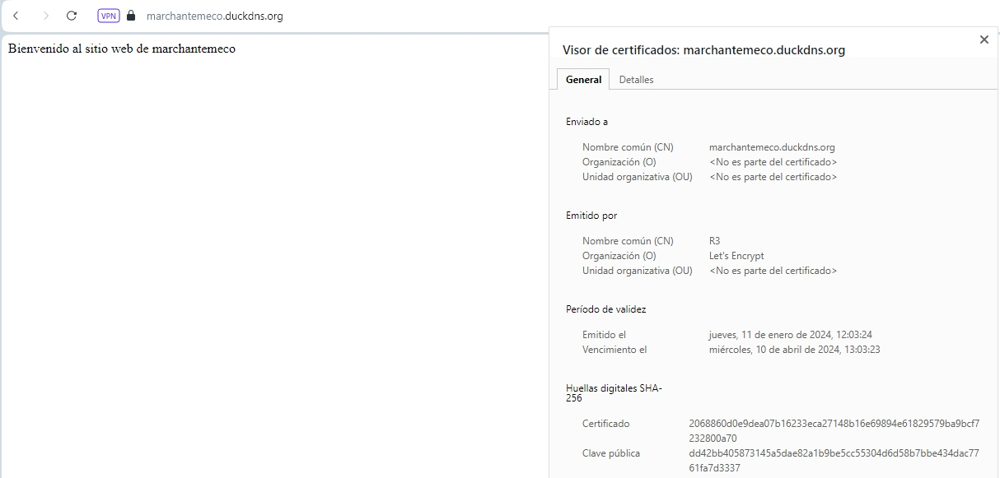

# Contenedor NGINX con certificado SSL firmado por Let’s Encrypt
***
Ahora que dominamos Apache, nos han pedido que para nuestro nuevo dominio marchantemeco.duckdns.org, alojemos en una nueva instancia AWS un **contenedor** NGINX con certificado SSL firmado por Let’s Encrypt.  
Pasos a seguir:  
1. Crear el dominio marchantemeco.duckdns.org desde [duckdns.org](www.duckdns.org)  
2. Poner en marcha los siguientes contenedores:  
    - duckdns, para que periódicamente compruebe si nuestra dirección IP ha cambiado y si es así informe a duckdns.org  
    - nginx, que será nuestro servidor web
    - nginx-proxy, cuya función es la de proxy inverso, redireccionando el tráfico hacia nuestro/s contenedor/es y a su vez forzando SSL, es decir, redirigiendo el puerto 80 al 443
    - letsencrypt, encargado de crear el certificado SSL para nuestro/s contenedor/es y renovarlo/s automáticamente  

    Para ello creamos el siguiente archivo docker-compose.yml y ponemos en marcha los contenedores con ```docker-compose up -d```
    ```
    version: '3'
    services:
      duckdns:
        image: lscr.io/linuxserver/duckdns:latest
        restart: always
        network_mode: host
        environment:
          - PUID=1000
          - PGID=1000
          - TZ=Europe/Madrid
          - SUBDOMAINS=marchantemeco.duckdns.org
          - TOKEN=eltokennotelopuedodecir
          - UPDATE_IP=ipv4
          - LOG_FILE=false
        volumes:
          - /home/ubuntu/duckdns/config:/config
      nginx-proxy:
        image: jwilder/nginx-proxy
        restart: always
        ports:
          - "80:80"
          - "443:443"
        volumes:
          - /var/run/docker.sock:/tmp/docker.sock:ro
          - certs:/etc/nginx/certs:ro
          - vhostd:/etc/nginx/vhost.d
          - html:/usr/share/nginx/html
          - acme:/etc/acme.sh
        labels:
          - com.github.jrcs.letsencrypt_nginx_proxy_companion.nginx_proxy
      letsencrypt:
        image: jrcs/letsencrypt-nginx-proxy-companion
        restart: always
        environment:
          - NGINX_PROXY_CONTAINER=nginx-proxy
        volumes:
          - certs:/etc/nginx/certs:rw
          - vhostd:/etc/nginx/vhost.d
          - html:/usr/share/nginx/html
          - /var/run/docker.sock:/var/run/docker.sock:ro
          - acme:/etc/acme.sh
      www:
        image: nginx
        restart: always
        expose:
          - "80"
        environment:
          - VIRTUAL_HOST=marchantemeco.duckdns.org,www.marchantemeco.duckdns.org
          - LETSENCRYPT_HOST=marchantemeco.duckdns.org,www.marchantemeco.duckdns.org
          - LETSENCRYPT_EMAIL=suso2asi@gmail.com
        volumes:
          - /home/ubuntu/www:/usr/share/nginx/html:ro
        depends_on:
          - nginx-proxy
          - letsencrypt
    volumes:
      certs:
      html:
      vhostd:
      acme:
    ```

3. Creamos una página web y comprobamos externamente que funciona  
    ```
    echo "Bienvenido al sitio web de marchantemeco" > /home/ubuntu/www/index.html
    ```
    

Fuente: [youtube](https://www.youtube.com/watch?v=S2YFqf4L7l8), no es la ideal, pero funciona.
