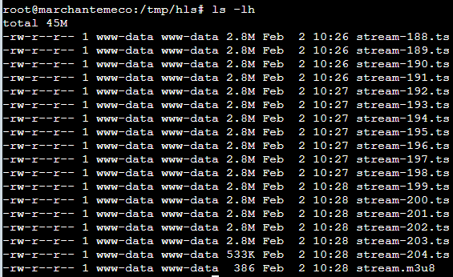
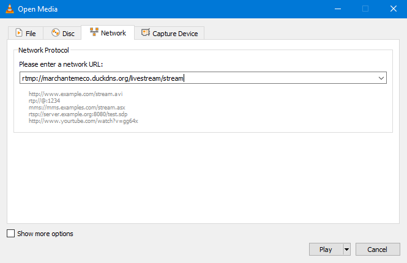
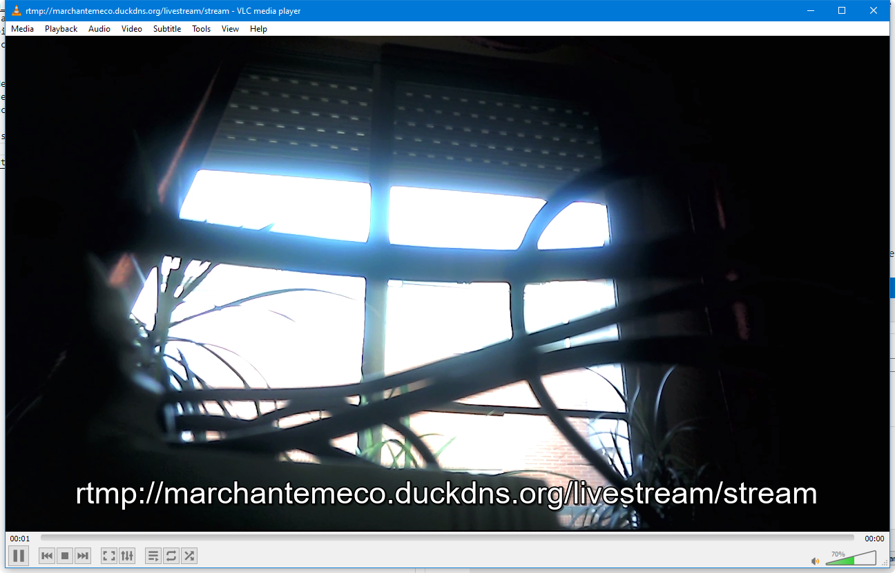
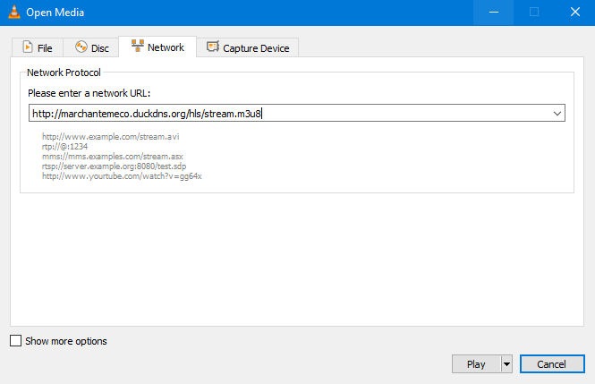
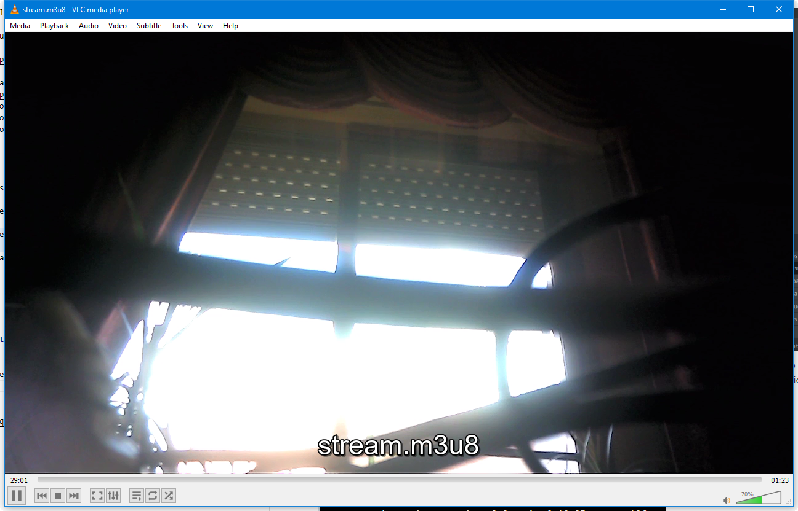

# Servidor de Streaming en AWS
***
Vamos a ampliar los servicios que ofrecemos en la empresa a servicios de Streaming. 
Desde el IES la Sénia nos han pedido que configuremos un servicio para poder retransmitir en directo la fiesta de graduación.  Tenemos que ofrecerles una solución!  
Una posibilidad sería desarrollar un servidor streaming con nginx utilizando el protocolo RTMP , desde el auditorio capturaríamos la imagen y audio con OBS utilizando un micro y una webcam y los participantes que no pueden asistir podrían visualizar la graduación desde la aplicación VLC.  
Podemos ampliar el servicio para que además de con VLC también puedan visualizar la retransmisión desde una página WEB.  
Pasos a seguir:  
1. El servicio trabaja en el puerto 1935, por lo que debemos abrirlo.  
2. Creamos la carpeta /tmp/hls
    ```
    mkdir /tmp/hls
    ```  
3. Instalar Nginx con los módulos necesarios para la transmisión de medios en tiempo real (rtmp). 
    ```
    sudo apt install libnginx-mod-rtmp
    ```  
3. Inicialmente para probar con el protocolo rtmp, añadimos el siguiente código al archivo de corfiguración de nginx /etc/nginx/nginx.conf:  
    ```
    rtmp {
      server {
        listen 1935;
        application livestream {
          live on;
          interleave on;
          hls on;
          hls_path /tmp/hls;
          record off;
          hls_fragment 6s;
          hls_playlist_length 60s;
        }
      }
    }
    ```  
4. Comprobamos que no hayan errores sintácticos  
    ```
    sudo nginx -t
    ```
5. Recargamos el servicio con la nueva configuración:  
    ```
    sudo systemctl reload nginx
    ```
6. Enviamos al servidor una fuente de audio/video mediante OBS Studio (con comandos y la herramienta ffmpeg también se puede):  
Si no lo tenemos instalado lo podemos hacer con ```sudo apt install obs-studio```  
Configuramos la emisión como un servicio personalizado.  
Introducimos la url del Servidor; protocolo (**rtmp**) :// dirección IP o nombre dns (**marchantemeco.duckdns.org**) / nombre del campo application que configuramos en nginx.conf (**livestream**)  
Configuramos la clave de retransmisión (**stream**), que la necesitaremos más adelante cuando configuremos vlc 
  
7. Comenzamos a emitir al servidor.  
La conexión ha sido exitosa tal como nos muestra el cuadradito inferior verde.  

8. Tal y como configuramos en el archivo nginx.conf, podemos comprobar que está fraccionando en el directorio **/tmp/hls** la señal recibida en archivos ts y creando el archivo stream.m3u8 (stream es la clave de la retransmisión que configuramos en OBS) listo para ser servido.  

9. Configuramos el cliente vlc  
Media -> Open Network Stream -> Network  
La url es exactamente la misma que la que configuramos en OBS seguida de la clave de transmisión (stream), rtmp://marchantemeco.duckdns.org/livestream/stream  

10. Tras pulsar Play comprobamos satisfactoriamente que estamos recibiendo el stream  
  
11. Para probar con el protocolo http en vez de rtmp, el archivo nginx.conf quedará tal que así:  
    ```                                                                                
    user www-data;
    worker_processes auto;
    pid /run/nginx.pid;
    include /etc/nginx/modules-enabled/*.conf;

    events {
      worker_connections 768;
    }

    http {
      sendfile off;
      tcp_nopush on;
      directio 512;
      default_type application/octet-stream;

      server {
        listen 80;
        location / {
          add_header 'Cache-Control' 'no-cache';
          add_header 'Access-Control-Allow-Origin' '*' always;
          add_header 'Access-Control-Expose-Headers' 'Content-Length';
          if ($request_method = 'OPTIONS') {
            add_header 'Access-Control-Allow-Origin' '*';
            add_header 'Access-Control-Max-Age' 1728000;
            add_header 'Content-Type' 'text/plain charset=UTF-8';
            add_header 'Content-Length' 0;
            return 204;
          }

          types {
                application/vnd.apple.mpegurl m3u8;
                video/mp2t ts;
                text/html html;
                application/dash+xml mpd;
          }
          root /tmp;
        }
      }
    }

    rtmp {
      server {
        listen 1935;
        application livestream {
          live on;
          interleave on;
          hls on;
          hls_path /tmp/hls;
          record off;
          hls_fragment 6s;
          hls_playlist_length 60s;
        }
      }
    }
    ```  
12. Comprobamos que no hayan errores sintácticos y recargamos el servicio con la nueva configuración:    
    ```
    sudo nginx -t
    sudo systemctl reload nginx
    ```
13. Configuramos el cliente vlc pero esta vez mediante el protocolo http.  
**¡ ATENCIÓN ! En la url ya no tenemos que poner livestream sino hls, que es la carpeta en el servidor donde está el archivo stream.m3u8**  
  
14. Tras pulsar Play comprobamos satisfactoriamente que estamos recibiendo el stream por http  
  


Fuente: [stackoverflow](https://stackoverflow-com.translate.goog/questions/67055812/streaming-via-nginx-and-hls-not-working-fully?_x_tr_sl=en&_x_tr_tl=es&_x_tr_hl=es&_x_tr_pto=sc)
