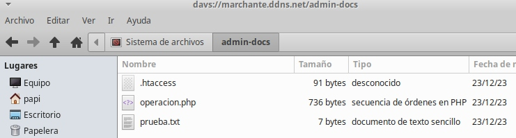
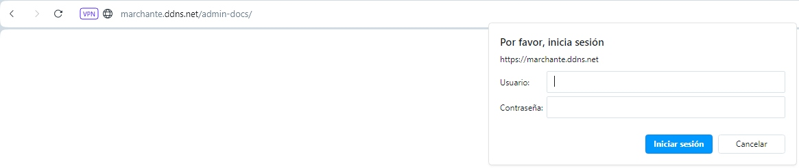
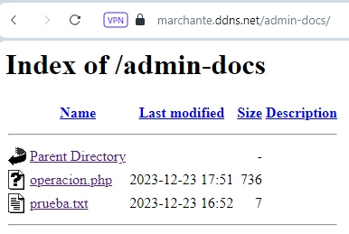
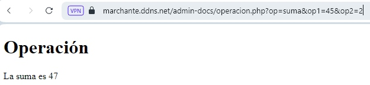

# WebDAV
***
Vamos a habilitar que el contenido del directorio /var/www/marchante/utiles/docs/recursos (si no existen habrá que crearlos con un comando que se llama ...... mkdir) de nuestro sitio web sea accesible, legible y editable; para ello necesitaremos no sólo un servidor web (Apache en nuestro caso), sino también un servidor WebDAV.  
Dicho recurso sólo será accesible por ciertos usuarios mediante autentificación Digest.  
Si te quedan pocas neuronas y no lo entiendes, es como tener un servidor Samba en internet, y accesible desde cualquier dispositivo incluso mediante un navegador web. 
Además se requiere poder modificar facilmente la configuración del directorio, por lo que su configuración estará en un archivo .htacess  
La guinda del pastel es que nuestro sitio web ha de interpretar código PHP, aunque ésto va a estar chupao.   

Pasos a seguir:  
1. Activar los módulos dav y dav_fs en Apache 
    ```
    a2enmod dav dav_fs
    ```
2. Editar el archivo de configuración de nuestro sitio web (/etc/apache2/sites-available/my_sitio.conf), y dentro de nuestro VirtualHost añadir:    
    - Mediante la directiva ``DAVLockDB`` indicamos el nombre de la base de datos de lock que se utilizará:  
        ```
        DavLockDB /var/www/DavLock
        ```
        DavLock es un archivo que será creado por el módulo (por lo que el usuario ``www-data`` ha de tener permiso de escritura en la carpeta que lo contiene), por lo que no debemos crearlo nosotros.  
    - Mediante la directiva [Alias](https://profesorjavi.github.io/curso_apache24/curso/u11/) indicamos que la carpeta ``recursos`` será servida en ``/admin-docs``:  
        ```
        Alias /admin-docs /var/www/marchante/utiles/docs/recursos
        ```
    - Creamos una sección Directory para el directorio que queremos acceder por WebDav (/var/www/marchante/utiles/docs/recursos), activamos el modo WebDav con la directiva ``DAV on`` e indicamos que sólo será accesible mediante autentificación [Digest](https://profesorjavi.github.io/curso_apache24/curso/u17/):  
        ```
        <Directory /var/www/marchante/utiles/docs/recursos>
            DAV On
            AuthUserFile "/etc/apache2/digest.txt"
            AuthName "admin"
            AuthType Digest
            Require valid-user
        </Directory>
        ```
    - .htaccess  
    Según tengo entendido, para el buen rendimiento del servidor lo ideal es no quitar del archivo de configuración para ponerlo en un archivo [.htaccess](https://profesorjavi.github.io/curso_apache24/curso/u19/), pero bueno.  
    En la sección Directory añadimos AllowOverride All, cortamos las líneas referentes a AuthUserFile, AuthName, AuthType, Require y las pegamos en el archivo /var/www/marchante/utiles/docs/recursos/.htaccess  
    - Para que nuestro sitio web interprete PHP es tan sencillo como instalar el módulo ``libapache2-mod-php`` el cual instalará a su vez todas las dependencias:
        ```
        apt install libapache2-mod-php
        ```  
3. Prueba:  
    - En Ubuntu (con Windows hay que hacer más cositas) y mediante el explorador de archivos introducimos en la barra de direcciones el protocolo, dirección IP o nombre DNS, recurso, en nuestro caso davs://marchante.ddns.net/admin-docs/  
    Se nos solicita usuario/contraseña:  
      
    Tras la validación podemos acceder al recurso como si estuviera localmente en nuestro equipo, es decir, no sólo tenemos permiso de lectura sino también de escritura:  
    
    - Mediante un navegador web introducimos en la barra de direcciones la dirección IP o nombre DNS y el recurso, en nuestro caso marchante.ddns.net/admin-docs
    Se nos solicita usuario/contraseña:  
      
    Tras la validación podemos acceder al contenido de nuestra carpeta ``recursos``; podemos descargar los archivos, pero no podemos modificarlos o crear nuevos.
      
    - Comprobamos que nuestro sitio web interpreta PHP:  
    Tras la validación añadimos a la url operacion.php?op=suma&op1=45&op2=2:  
      

